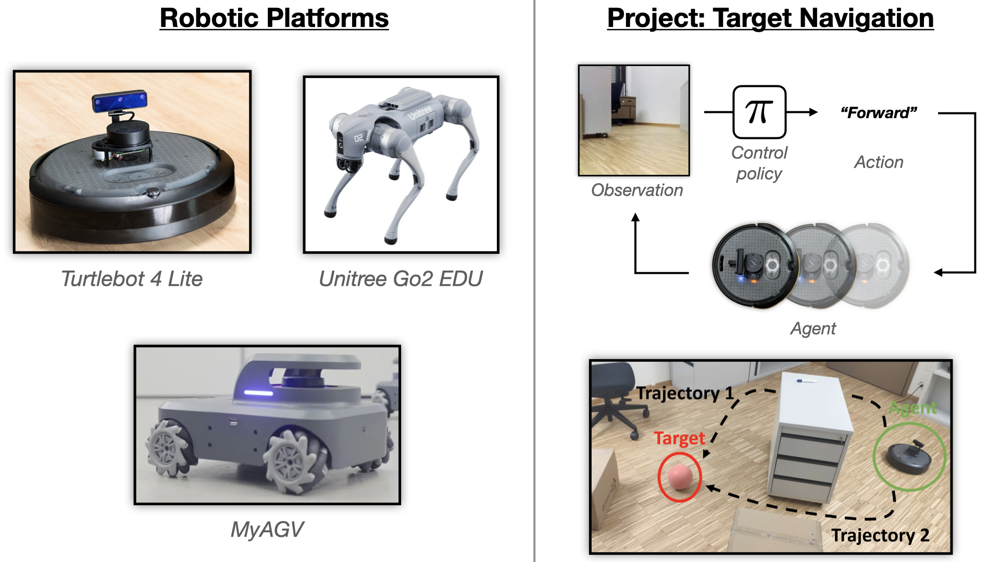

# COM-304: Communication Project. Robotics Project.

This repository contains the material for the perceptual robotics project of the course COM-304 at EPFL.
- [COM-304: Communication Project. Robotics Project.](#com-304-communication-project-robotics-project)
- [Project](#project)
- [Homeworks](#homeworks)
- [Studying Material \& Resources](#studying-material--resources)
- [Suggested Order of Study](#suggested-order-of-study)
- [General Info](#general-info)

# Project

The goal of the project is learning to **program a robotic agent to accomplish a task autonomously based on visual sensory inputs**. You will implement your project using one of the following robotic platforms:
- [TurtleBot 4 Lite](https://clearpathrobotics.com/turtlebot-4/) (multiple available)
- [MyAGV](https://www.elephantrobotics.com/en/myagv-en/) (1 available)
- [Unitree Go2](https://www.unitree.com/go2) (1 available, EDU version, fully programmable)

See the [Project Guidelines](https://www.overleaf.com/read/qrfkgnbmmsdj#53611f) document for the full description.

Note that Go2 and MyAGV platforms are unsupported, i.e., we provide detailed instruction and material only for the TurtleBot platform, and you would need to do the migration to these platforms yourself if you would like to use those platforms. However, both Go2 and MyAGV platforms use ROS2, so the tutorial and the HW1 will sill be useful for you to get started with these platforms.

# Homeworks
There will be two homeworks that will help and prepare you for the project:

- [HW1: ROS2 & Turtlebot](ROS_Homework_Ungraded/ROS2_homework_task.md). Introduction to ROS2 and the Turtlebot4 platform. This helps with the **hardware** aspect.
- [HW2: RL & Habitat](RL_Habitat_Homework/RL_Habitat_Homework.ipynb). Introduction to Habitat and Reinforcement Learning. This helps with the **machine learning, control**, and **perception** aspects.

# Studying Material & Resources

- [ROS2 & Turtlebot4 Setup](Turtlebot4_setup/Turtlebot4_setup_guide.md): This guide will help you set up ROS2 and the Turtlebot4 simulator on your local machine or on a VM.
- [RL Reading Material](https://docs.google.com/document/d/1zz7baFWC2G-mnlW9Ie-Xko2-k3RD4nzJ9XM1VsWalxU/edit#heading=h.h15fdpbwsi98): This document contains a list of resources for studying Reinforcement Learning to prepare you for the second homework and the project.
- [SCITAS](SCITAS_Tutorial/scitas_tutorial.md): How use the SCITAS cluster.

# Suggested Order of Study
1. **ROS2 & Turtlebot4 Setup and HW1**: Start by studying the ROS2 and Turtlebot4 setup guide and complete the first homework. This will give you understanding of ROS2 and the Turtlebot4 platform for the project.
2. **RL & Habitat Reading Material and HW2**: After completing the first homework or during it, start studying the RL reading material and complete the second homework by the corresponding deadline. This will prepare you for trianing your own control policy for the project.

# General Info

- **Platforms Storage:** For the Turtlebot and MyAGV platforms, we give them to you for the duration of the project, so you can take them home. If you wish to store them at EPFL, you can book a locker avaliable for students [here](https://mycamipro.epfl.ch/client/lockerassign). For the Unitree Go2, we will arrange an a solution with the team. Please bring the equipment back undamaged. 

<!-- # Pending
- [ ] Add instructions to use the RL notebook on SCITAS after the maintenance.
- [ ] Do a final test of the RL notebook on SCITAS. -->
