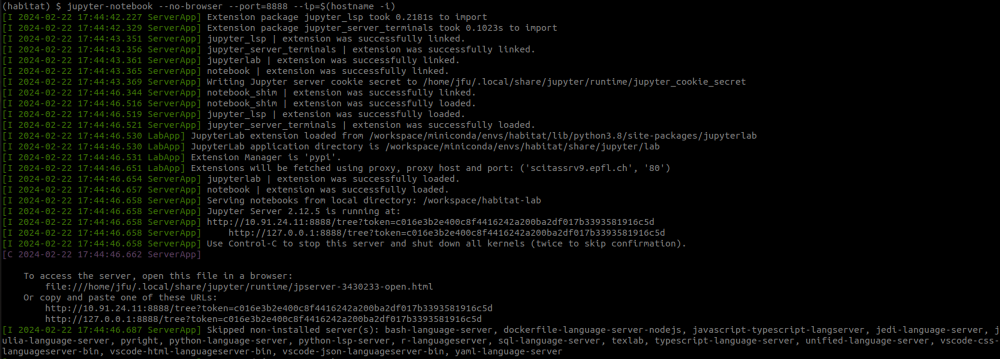

# RL Homework

We are going to use `Habitat` as the simulation engine for our reinforcement learning (RL) homework.
Habitat is a simulation platform for research in Embodied AI, which only works on Linux and MacOS systems. 
To simplify the installation procedure, we provide you with a pre-built `Apptainer` image with `Habitat` installed.
You will run the `Apptainer` image to run the jupyter notebook on the `Izar` cluster of `SCITAS`.

**NOTE**: If you don't want to use the pre-built image, you can freely choose to install `Habitat` on you own machine or in `Colab`. But we are not going to support those platforms.

## Terminology
The `<user>` mentioned in the following sections is your username on the `Izar` cluster. Please replace it when you execute the commands.

## Prepare the pre-built `Apptainer` image

1. Download the zipped pre-built `Apptainer` image (`com304-habitat.sif.tar.gz`)[[Google Drive](https://drive.google.com/file/d/1VB_u-gGdy5VKwpvxb9ZW3xQznqoTN6EE/view?usp=sharing)] onto your local machine. 
2. Upload the zipped image onto the cluster by using the command below. It will take some time depending on your network speed.
   ```bash
   scp /path/to/com304-habitat.sif.tar.gz <user>@izar:/home/<user>/myimages/
   ```
3. Login the izar cluster and unzip the image by the command below.
   ```bash
   cd /home/<user>/myimages/
   tar -xvf com304-habitat.sif.tar.gz 
   ```
   With that you’ll have a `com304-habitat.sif` folder which represent the image.

## Prepare the workspace folder
1. Create a folder called `COM-304_ws` in `/home/<user>/` on the clusters.
   ```bash
    mkdir /home/<user>/COM-304_ws
    ```
2. Pull the `comm-proj-habitat-lab` repository into the `COM-304_ws` folder.
   ```bash
   cd /home/<user>/COM-304_ws
   git clone git@github.com:JayeFu/comm-proj-habitat-lab.git
   ```
3. Pull the `com-304-robotics-project` repository into the `COM-304_ws` folder.
   ```bash
   cd /home/<user>/COM-304_ws
   git clone git@github.com:EPFL-VILAB/com-304-robotics-project.git
   ```

## Download necessary assets
1. Download the assets `data.zip` onto your local machine [[Google Drive](https://drive.google.com/file/d/1VAy60Xlw_4-6wF6yijnJlwXUE2zrGrfK/view?usp=sharing)].
2. Upload the zipped assets onto the cluster by using the command below. It will take some time depending on your network speed.
   ```bash
   scp /path/to/data.zip <user>@izar:/home/<user>/COM-304_ws/com-304-robotics-project/RL_Habitat_Homework/
   ```
3. Unzip the assets by the command below.
   ```bash
   cd /home/<user>/COM-304_ws/com-304-robotics-project/RL_Habitat_Homework/
   unzip data.zip
   ```

## Submit a job to acquire a compute node

1. Create a file called `submit_sleep.run` in `/home/<user>/myimages/` on the clusters. The content of the file is as follows.
   ```bash
   #!/bin/bash

   #SBATCH --nodes 1
   #SBATCH --ntasks 1
   #SBATCH --cpus-per-task 8
   #SBATCH --mem 16G
   #SBATCH --gres=gpu:1
   #SBATCH --time 01:00:00
   #SBATCH --output=./logs/slurm-%j.out

   sleep infinity
   ```
2. Submit the job by the command below.
   ```bash
   cd /home/<user>/myimages/
   sbatch submit_sleep.run
   ```
3. Now you can use `squeue -u <user>` to check your job status. Once the job is running, please note down the `JOBID` of the job for the next step.

**REMARK**: If your job is pending for a long time, please consider using
```bash
#SBATCH --account=com-304
#SBATCH --reservation=Course-com-304
```
for our reserved GPUS and
```bash
#SBATCH --account=com-304
#SBATCH --qos=com-304
```
for our high-priority queue.

## Start the jupyter notebook server in the compute node

1. Login the compute node on the clusters. Replace `<JOBID>` with the `JOBID` you noted down in the previous step.
   ```bash
   srun --pty --jobid <JOBID> /bin/bash
   ```
2. Start a tmux session on the compute node.
   ```bash
   module load tmux
   tmux new -s jupyter
   ```
3. Start a container from the pre-built `Apptainer` image.
   ```bash
   apptainer shell \
      --nv \
      --writable \
      --bind /home/<user>/COM-304_ws/comm-proj-habitat-lab:/workspace/habitat-lab/ \
      --bind /home/<user>/COM-304_ws/com-304-robotics-project/RL_Habitat_Homework:/workspace/RL_Habitat_Homework/ \
      /home/<user>/myimages/com304-habitat.sif
   ```
4. Activate the conda environment.
   ```bash
   /workspace/miniconda/condabin/conda init bash
   source ~/.bashrc
   conda activate habitat
   ```
5. Install `habitat-lab` packages on the fly for latest code change
    ```bash
    cd /workspace/habitat-lab/
    pip install -e habitat-lab/
    pip install -e habitat-baselines/
    ```
6. Start the jupyter notebook server.
   ```bash
   cd /workspace/RL_Habitat_Homework/
   jupyter-notebook --no-browser --port=8888 --ip=$(hostname -i)
   ```
   Its output should be similar to the image below.
    
   Please note the line with the token `<token>` and the IP address `<ip-address>`. You will need it in the next step.
   
   For example, in the image above, the line looks like
   ```
   http://10.91.24.11:8888/tree?token=c016e3b2e400c8f44162428200ba2df017b3393581916c5d 
   ```
   where the ip address `<ip-address>` is `10.91.24.11` and the token `<token>` is `c016e3b2e400c8f44162428200ba2df017b3393581916c5d`.
7. Forward the port from the compute node to your local machine, by executing the following command on **your local machine**. Replace `<ip-address>` with the IP address you noted down in the previous step.
   ```bash
   ssh -L 8888:<ip-address>:8888 -l <user> izar.epfl.ch -f -N
   ```
8. On your local machine, open a web browser and enter the following URL. Replace `<token>` with the token you noted down in the previous step.
   ```
   http://127.0.0.1:8888/tree?token=<token>
   ```

## Start coding!
Congratulations! You have successfully started the jupyter notebook server on the compute node. Now you can start coding in the jupyter notebook.

## **Usefull commands for tmux and jupyter**

- exit the tmux session `ctrl+b` and then type `:detach`
- scroll inside the tmux session `ctrl+b` and then `[`
- enter in the tmux session `tmux attach -t <name>`
- kill the tmux session `tmux kill-session -t <name>`
- kill a process (after finishing with jupyter): `lsof -i :8888` and take the id and do `kill <id>`
