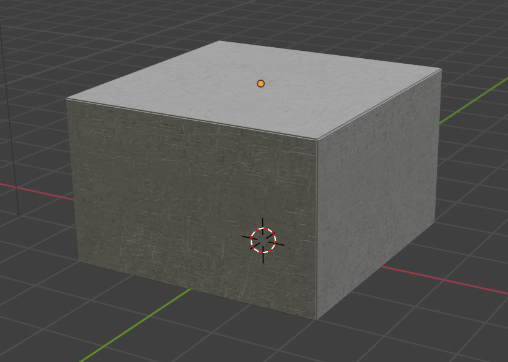
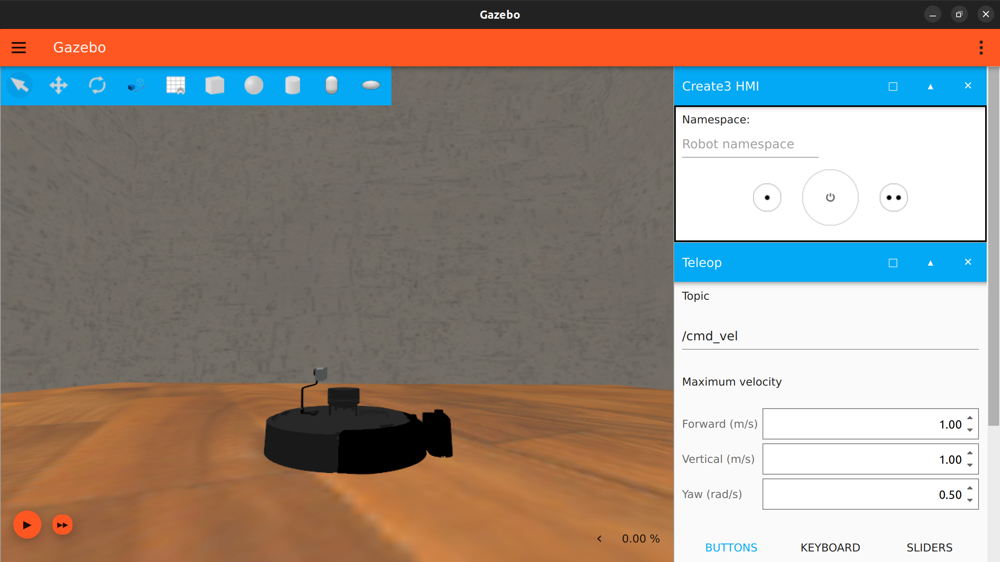

# CS-304 ROS Homework - Action Server and Client

In this homework task, you will learn the fundamentals of ROS2 with a concrete implementation of client-server actions. This homework is divided in 2 parts:

- The first part is a theoretical section where you will read and learn basic principles of ROS2 by yourself, and implement a basic message passing system.
- The second part consists of implementing what you learned to programmatically control a turtlebot4 lite in the gazebo simulator. This will also involve learning more intermediate ROS2 concepts which will be needed to complete your project later into the semester.

This homework is not just coding based, but instead a set of tasks that requires you to thoroughly read documentation and formulate your understanding of a new software stack from scratch. At the end, you should be able to launch a simulated robot in a world you created, and control it according to actions that you send it.

As you know, this is a project-based course so feel free to read, test, and implement what you read to gain more confidence. The concepts you learn in this tutorial are fundamental to working with robots using ROS2 and you will use them a lot during the project, so it's worth putting in some time now to learn them well.

This homework is worth 10% of your overall grade and is split into 100 points in total. Note that the number of points does not necessarily correspond to the length of the description required, more the difficulty of the question. Your answer can be as brief or as long as needed to answer the question, but try to keep your answers brief overall.

The main references for this homework task are:

- The ROS2 Humble documentation: <https://docs.ros.org/en/humble/>
- The turtlebot4 manual: <https://turtlebot.github.io/turtlebot4-user-manual/>

## Table of Contents

- [CS-304 ROS Homework - Action Server and Client](#cs-304-ros-homework---action-server-and-client)
  - [Table of Contents](#table-of-contents)
  - [Part 1 - Theory (40 points)](#part-1---theory-40-points)
    - [ROS2 in the CLI](#ros2-in-the-cli)
    - [ROS2 with python](#ros2-with-python)
  - [Part 2 - Action Client/Server (30 points)](#part-2---action-clientserver-30-points)
    - [Robot Motion](#robot-motion)
  - [Part 3 - Custom Simulation Worlds (30 points)](#part-3---custom-simulation-worlds-30-points)
    - [Launch files](#launch-files)
    - [Creating a custom model](#creating-a-custom-model)
    - [Creating a custom world](#creating-a-custom-world)
    - [Final submission](#final-submission)
  - [Conclusion](#conclusion)

## Part 1 - Theory (40 points)

### ROS2 in the CLI

ROS (short for **R**obot **O**perating **S**ystem) is a set of software libraries that makes controlling robots much simpler and easier. You should have already installed ROS2 Humble in a Ubuntu 22.04 instance while setting up the turtlebot4. If not, go follow the [turtlebot4 setup guide](/Turtlebot4_setup/Turtlebot4_setup_guide.md) (specifically the sections on [setting up the local PC](/Turtlebot4_setup/Turtlebot4_setup_guide.md#1-local-pc-setup-link-to-reference) and [setting up the simulator](/Turtlebot4_setup/Turtlebot4_setup_guide.md#simulator-link-to-reference)), as this homework assumes you've already installed ROS, the turtlebot4 packages and the gazebo simulator.

Learning ROS2 is made much easier because there are an [excellent set of tutorials](https://docs.ros.org/en/humble/Tutorials.html) made to teach all the fundamental concepts from scratch. These tutorials should be your first reference for any questions you have about ROS2, and we will be relying on you doing them up the the intermediate level to complete this homework fully.

To begin with, the ROS system does not rely on a specific language like python on C++, but instead can run in the background on your system and can be controlled directly from the command line interface (CLI). Working with ROS from the CLI can help you learn the basics of what different components do and how they fit together.

In this section of the homework, you should go through the ROS2 CLI tools tutorial (<https://docs.ros.org/en/humble/Tutorials/Beginner-CLI-Tools.html>), following along and ensuring you can run everything from the tutorials on your PC. Once you've done that, you should be able to answer the below questions about the basics of ROS:

- (2 points) What do you need to run in every new shell before you can use ROS2? Is there a way to skip having to run this in every new shell?
- (3 points) What is a node? How much should a single node generally do? How many publishers/subscribers/services/actions can one node have/offer?
- (2 points) What is a topic? How many publishers can publish to a single topic? How many subscribers can subscribe to a single topic?
- (2 points) What is a service? How can you call a service from the command line?
- (2 points) What is a ROS parameter? When might you want to use a ROS parameter over other parameter types?
- (2 points) What is an action? How are they different from services?
- (1 point) How can you find all of the currently active nodes/topics/services/parameters/actions?
- (1 point) How can you view the full ROS interaction graph?

### ROS2 with python

Now that you understand some of the basic concepts of ROS and how to perform some basic actions in the CLI, the next step is to actually implement some custom ROS components in code. You can program ROS2 in both python and C++ (you can even have both python and C++ together in the one package!) but to keep things simple, we'll be working in python.

For this section of the homework you'll need to read through the ROS2 client libraries tutorial (<https://docs.ros.org/en/humble/Tutorials/Beginner-Client-Libraries.html>), but only the python sections, not the C++. Once you've gone through the tutorials, you should be ready to apply what you've learnt to the following toy example, while thinking about the questions asked at each step:

1. Create a local ROS2 workspace (should already be done from the tutorials). (Don't worry if you get `stderr [...] setup.py install is deprecated`, this is an issue with ROS2 not meeting current pip standards and shouldn't affect you negatively)

    - (1 point) When should a workspace be rebuilt?
    - (1 point) What is the `src` folder for? What should go in here?
    - (1 point) What do you need to `source` to be able to use your local workspace?
    - (1 point) How can you easily check for missing dependencies of packages in a workspace?

2. Create a package called `pubsub_turtle` with 2 nodes: `move_controller` and `computation_controller`. Remember that our package only has to work with Python, not C++.

    - (1 point) How do you make sure a node is initialized in python?
    - (1 point) What do you need to change in `package.xml` for a new package?
    - (1 point) What do you need to change in `setup.py` for a new package?

3. Modify the `computation_controller` node python code to first print a hello message to the command line, and then destroy the node.

    - (1 point) How do you use the ROS logger (it's generally better to use than `print()`)?
    - (2 point) Why is it good practice to destroy a node after it is finished running?
    - (1 point) What do you need to change in `package.xml` for a new node?
    - (1 point) What do you need to change in `setup.py` for a new node?
    - (1 point) What should be in `setup.cfg`?

4. Now modify the `computation_controller` node to instead *publish* the hello message to a topic `/turtle_hello` every second.

    - (2 point) How can you create a publisher in a python file? What arguments do you need to initialize one?
    - (2 point) What `msg` type should be used to publish a string? How can you check the proper structure of a `msg`? How can you import ROS2 messages into a python script to use them in code?
    - (2 point) How can you do tasks at a specific rate in ROS2?
    - (2 point) How can you check this message is properly being published from the CLI?
    - (1 point) What might you need to change in `package.xml` when you modify a package?

5. To finish this section, try and set up the two nodes such that they both send messages to each other. Your first step will be to make a subscriber in `move_controller` that can receive the hello message sent by `computation_controller`. Then, try and modify `move_controller` to send a message to `computation_controller` on a different topic. You'll also have to modify `computation_controller` here to make it capable of receiving the sent message.

    - (2 point) How can you create a subscriber in a python file? What arguments do you need to initialize one?
    - (1 point) What do you need to change in `setup.py` to be able to run the second node?

You should now have a ROS2 package with two nodes that can send messages to each other. This is an example of a basic ROS system, but of course so much more complicated tasks can be done as well. To practice you can try and add some more of these harder tasks into this system. Some things that could be worth trying are:

- Sending different kinds of messages other than strings. As a starting point you can look up `std_msgs` for some other basic message types. Are there other message packages like `std_msgs`?
- Implementing custom `msg` types instead of just in-built ones.
- Changing the system to a client/service approach, where one node (the service) will send a response to the other (the client) when it is requested to do so.

It's definitely worth trying all this and more now, because these are all concepts you could use in your full project!

## Part 2 - Action Client/Server (30 points)

For the final section of the homework, you'll need to to a bit more reading first to understand *actions*. You should read through the [intermediate tutorials](https://docs.ros.org/en/humble/Tutorials/Intermediate.html) up to and including at least 'Writing an action server and client', but reading the rest of the intermediate tutorials is highly recommended, particularly the sections on [launch files](https://docs.ros.org/en/humble/Tutorials/Intermediate/Launch/Launch-Main.html) and [frames using tf2](https://docs.ros.org/en/humble/Tutorials/Intermediate/Tf2/Tf2-Main.html).

Because we're working with the turtlebot4 lite, we have access to an existing ROS2 software suite that has been developed to control the robot. We'll be taking full advantage of that in this upcoming section. You can find the documentation of the software suite here: <https://turtlebot.github.io/turtlebot4-user-manual/>. Make sure to use this as a reference through this section of the homework (and also when working with the robot in general).

### Robot Motion

Our goal now is to implement what you learned before in a package to control the turtlebot4. The final structure of the package is simple:

- The `computation_controller` node will determine an action for the robot to perform and will pass it to the `move_controller`.
- The `move_controller` is going to instruct the robot to do the action received,and then request a new action from `computation_controller`.
- We will have 3 different actions that can be taken:
    1. Move forward 0.25m
    2. Turn 30° left
    3. Turn 30° right
- Until the action sent to `move_controller` is complete, no other action should either be requested by `move_controller` or sent from `computation_controller`.

To implement this, there are a few steps we recommend:

1. Make sure you understand what actions are, how you implement them using python and why we're using them here (instead of services or publishing messages).
2. Find existing actions already implemented for the turtlebot4 (Hint: the Create 3 comes with some useful actions you can find [here](https://turtlebot.github.io/turtlebot4-user-manual/software/create3.html)).
3. Using the actions you found, implement the system as described above.
4. Before running in simulation, to test the system is working properly you can just print the actions received by `move_controller`.
5. For now feel free to test a random sequence of actions of your choosing.

Once you have implemented the system you can test it in simulation using gazebo. I recommend using an empty world (add `world:=empty` to the simulation launch command) initially to make the simulation faster. Remember that you'll have to undock first before performing the sequence of actions (which you can also do programmatically using an action!).

To submit your answer to this stage of the homework, please upload a zipped copy of your package at this stage with working `move_controller` and `computation_controller` nodes.

## Part 3 - Custom Simulation Worlds (30 points)

(This section has a lot of explanation to help you understand whats going on. Its all pretty important, so do make sure to read it all, but to make things easier all the parts which will require you to actually do something on the computer start with **!!!**)

Now that we can move our robot with code, the next step is to set up our simulation world to be a bit more realistic. While gazebo provides some default worlds, it would be much better to test in a simulated world that is very similar to the real-world scenario the robot would run in. So, in this section we're going to look into how we can implement a custom world that we built.

The gazebo simulation environment is specified through a *world file*, sdf files that typically have the extension `.sdf` or `.world`. This file specifies all the details about the environment such as the physics of the scene, the lighting and the objects present. Objects in the world will often have their own files describing their properties such as mass, inertia, collision, texture and shape.

When you launch the simulator, you can pass the world you want to use as an argument, like we did above for the blank world with `world:=empty`. There are other worlds that come bundled with the turtlebot4 software package such as `depot` or `warehouse`, but what we're going to do is design our own world to test with.

Your ROS2 workspace file structure should currently look something like this (maybe you only have a `pubsub_turtle` package that you modified, but this won't change anything):

```txt
📦 ros2_ws
 ├─ 📂 build
 ├─ 📂 install
 ├─ 📂 src
 │   ├─ 📂 <action_package>
 │   │   ├─ 📂 resource
 │   │   ├─ 📂 test
 │   │   ├─ 📂 <action_package>
 │   │   │   ├─ 📜 computation_controller.py
 │   │   │   └─ 📜 move_controller.py
 │   │   ├─ 📜 package.xml
 │   │   ├─ 📜 setup.cfg
 │   │   └─ 📜 setup.py
 │   └─ 📂 pubsub_turtle
 └─ 📂 log
```

**!!!** To this you should now add 3 new folders:

- `ros2_ws/src/<action_package>/worlds`
- `ros2_ws/src/<action_package>/models`
- `ros2_ws/src/<action_package>/launch`

The `worlds/` folder will store our `.world` files, which will provide a top-level description of our world. The `models/` folder will store the `.sdf` files that describe the objects in our world. The `launch/` folder will store our [`.launch` files](https://docs.ros.org/en/humble/Tutorials/Intermediate/Launch/Launch-Main.html).

### Launch files

For this section, please refer to the [ROS2 guide on launch files](https://docs.ros.org/en/humble/Tutorials/Intermediate/Launch/Launch-Main.html) for more information about the concepts presented.

As you may have read earlier, launch files allow us to run a whole sequence of nodes in parallel, and can make managing large systems much easier. It can also allow our code to be much more reusable for other tasks as well.

In this homework task, we would like to launch the simulator (which internally needs a bunch of nodes to properly run) and our two controller nodes to launch together. Because we need to press play in the simulator *after* it has launched to run the simulation. This makes launching the simulation together with the controllers a bit hard, so we'll skip that for this task. So, we'll provide you with a couple launch files as examples that can launch the simulator with custom models, and leave you to make one for the controller nodes on your own.

You've likely already launched the simulator a few times, but to use custom assets we need to make some changes to let gazebo find them. This is done by setting the environment variable `IGN_GAZEBO_RESOURCE_PATH` to the paths the custom assets should be found. However due to some less than perfect code in the `turtlebot4_simulator` package, this variable is overwritten in some of their launch files. So, we need to fix that and add the locations our models and worlds will be.

**!!!** Download the two launch files in the `launch_resources` and copy them into your `launch` folder. Note that these are modified copies of existing launch files from `turtlebot4_simulator`. In `ignition.launch.py` on line 61, and in `turtlebot4_ignition.launch.py` on line 52, change the package name in `get_package_share_directory()` to your package name ie.

```py
get_package_share_directory("<your_package>")
```

Also note that the environment variable `IGN_GAZEBO_RESOURCE_PATH` is changed in `ignition.launch.py` as discussed before on line 67 and 68.

**!!!** Now we need to make some changes to `setup.py` and add to the `data_files` list. First add the below two lines to the list:

```py
(os.path.join("share", package_name, "launch"), glob(os.path.join("launch", "*launch.[pxy][yma]*"))),
(os.path.join("share", package_name, "worlds"), glob(os.path.join("worlds", "*"))),
```

**!!!** These will make it so that you can use `.launch` files and and world files in the `worlds` folder (also make sure to add `import os` and `from glob import glob`). The `models` folder is a bit more complex as the above approach only works for flat folder structures. To add the `models` folder to `data_files`, first add the below function to `setup.py` to be defined *before* the `setup()` function runs:

```py
# Iterate through all the files and subdirectories to build the data files array
# We need this to maintain the file structure of `models/` in the installed package
def generate_data_files(share_path, folder):
    data_files = []

    for path, _, files in os.walk(folder):
        list_entry = (
            os.path.join(share_path, path),
            [os.path.join(path, f) for f in files if not f.startswith(".")],
        )
        data_files.append(list_entry)

    return data_files
```

**!!!** Then, as this function returns a list, *add* the result of the function to the data files list like:

```py
data_files=[
    ...
] + generate_data_files(os.path.join("share", package_name), "models"),
```

A skeleton example of this is in `launch_resources/example_setup.py`

**!!!** Finally, make sure you add `<exec_depend>ros2launch</exec_depend>` to your `package.xml`. Now (after you rebuild your ROS2 workspace), you should be able to launch the turtlebot simulator using:

```bash
ros2 launch <your_package> turtlebot4_ignition.launch.py model:=lite
```

**!!!** (5 points) Next, use these two launch files as examples to make your own launch file that can launch the two controller nodes you've wrote together.

Note: if you change a launch file, a model or a world file, you will **always** have to rebuild your ROS2 environment for the changes to take hold. This is because these all require files to be written as they are `data_files` assets and so aren't properly tracked by `colcon build --symlink-install` like python scripts are.

### Creating a custom model

For this section, please refer to this [old gazebo guide on creating a robot model](https://classic.gazebosim.org/tutorials?cat=build_robot), and this [tutorial which has more info on sdf files](https://gazebosim.org/docs/harmonic/building_robot) for more information about the concepts presented. [This one](https://classic.gazebosim.org/tutorials?cat=guided_i&tut=guided_i2) also has a nice outline of the process of importing meshes. [This one](https://classic.gazebosim.org/tutorials?tut=color_model) has some details about textures. Note that we're not going to go into too much detail about how to make models using blender, freeCAD or other similar software here, only how to import these models into your gazebo world.

For your custom world, you might not be satisfied with existing models that can be found online (in registries like the [core gazebo database](https://github.com/osrf/gazebo_models) or elsewhere) and want to make our own from scratch, say to match real world objects and mimic the environment the real robot will run in. You can use different 3D modellers to create textured meshes for the models, but for this homework task we'll use [Blender 4](https://www.blender.org/download/releases/4-0/) to export these models into the proper format. If you want to install blender in ubuntu you can simply run  `snap install blender --classic`, but the modelling should be able to be done on any OS you like.

**!!!** In this repo, the `model_resources` folder contains the blender file and textures of a basic empty room. Open `empty_room.blend` in blender and you should see a room:

<div align="middle">
  
</div>

**!!!** From here, export the model to a collada file by selecting `File -> Export -> Collada (.dae)`. This should export the `.dae` file and 2 images, which together describe the room model.

Next, the model has to be defined in our ros workspace. To start, we'll provide a snapshot of what the `models` folder in the `<action_package>` folder should look like when everything is done for you to refer to as you set up your model:

```txt
📂 models
 ├─ 📂 empty_room
 │   ├─ 📂 materials
 │   │   ├─ 📂 textures
 │   │   │   ├─ 🖼 diagonal_parquet_diff_1k.jpg
 │   │   │   └─ 🖼 plastered_wall_diff_1k.jpg
 │   ├─ 📂 meshes
 │   │   └─ 📜 meeting_room.dae
 │   ├─ 📜 model.config
 │   └─ 📜 model.sdf
```

**!!!** Start by creating the above folder structure and copying the `.dae` and `.jpg` that were exported from blender to the `meshes` and `textures` folders respectively. Next, download the `model.config` and `model.sdf` files from the `model_resources` folder in this repository, and copy them into the `models/empty_room` folder.

Note that the `model.config` file references the `model.sdf` file, which *then* references the `meeting_room.dae` file (which actually already references the two texture images internally too).

- The `model.config` file is the highest level file in a tree that describes a model, and usually just contains some metadata, versioning etc.
- The `model.sdf` describes the actual structure of the model in more detail. Some objects such as a full robot can require more that a single static mesh to describe, and may have moving joints that need to relate to each other. This `.sdf` file can describe all this with *links*, which are connected by *joints*.
- The `empty_room.dae` file defines a mesh, and can be referenced by `.sdf` files to give visuals or collision to links.

For the purposes of this project, you shouldn't have to deal with any of this extra complexity luckily, and so these templates should be good enough.

### Creating a custom world

Finally, we can use this custom model to create a custom world for our simulated robot to move around in. For this we need a `.world` file which defines how the models are placed in the simulator, the world physics, lighting and other similar concepts. The `.world` file, similar to `.sdf` files, `.dae` files and `model.config` is written with `xml` syntax.

**!!!** As a baseline, we've provided a basic world file `custom_env.world`. This can be extended with more models if you want to make it more realistic and challenging. To use the world file, download it and copy it into the `worlds` folder. From here, you should be able to use launch the world with the launch file that was created earlier:

```bash
ros2 launch <your_package> turtlebot4_ignition.launch.py model:=lite world:=custom_env
```

<div align="middle">
  
</div>

(5 points) Upload a screenshot of the simulator running with the custom world.

### Final submission

(20 points) Using what you have made and learned so far, make your robot drive in the shape of an equilateral triangle path with side lengths of 0.5 meters in gazebo. If the path isn't perfect due to noise, that's ok and won't be marked down, but the shape should be roughly correct, and the code should theoretically produce the correct shape when ran.

Submit the ROS package you developed zipped into a single file, along with a screen recording of the robot driving along the triangle path. While the robot is driving you shouldn't be inputting any commands i.e. the robot should be moving fully autonomously.

## Conclusion

And that's it! You should now know all the basics needed to programmatically control a turtlebot in simulation in an environment that you defined on your own. This homework task contains a lot of information that will help you to work with your robot, so please come back to it if you get stuck later in the semester working with ROS or the simulator.

Some good things to try now that could help with your project later down the line are:

1. Add more models to the simulation to make it more realistic.
2. Read frames from the camera (Hint: the camera should publish to ROS2 topics)
3. Try and decide the actions the controller makes depending on some observation of the environment eg. the camera output.

Best of luck with the project!
