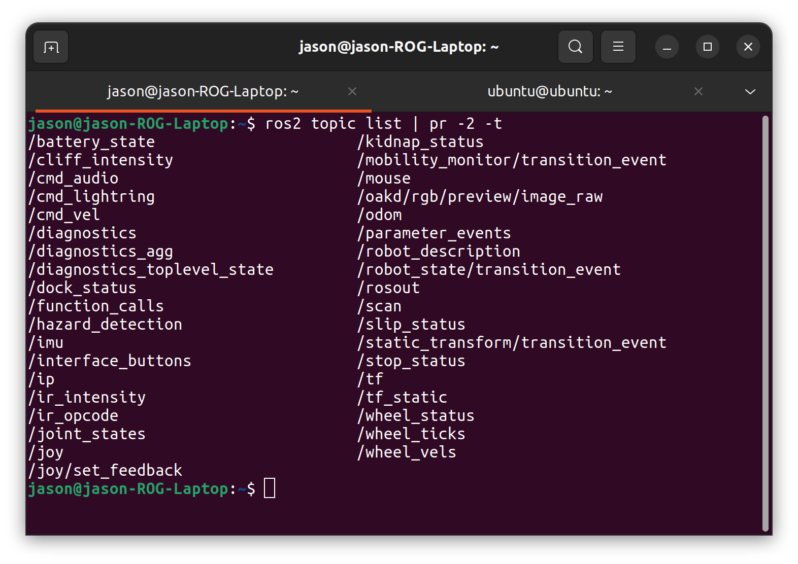
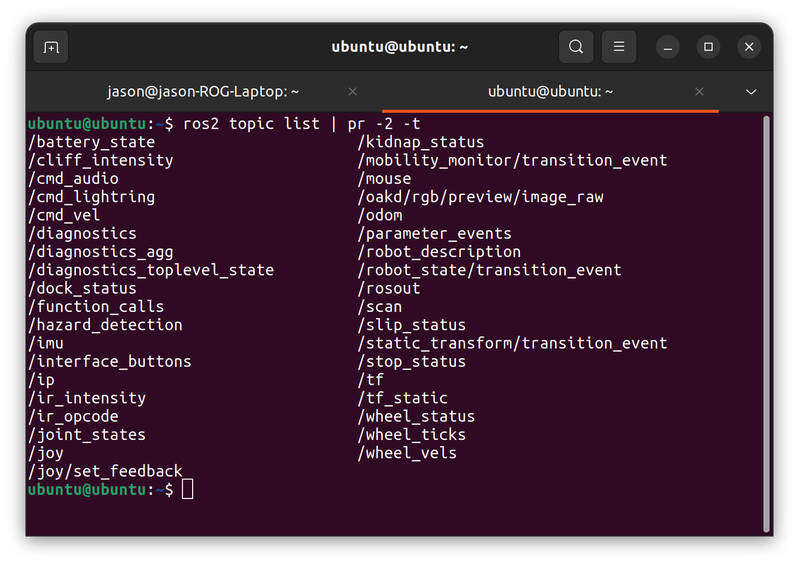
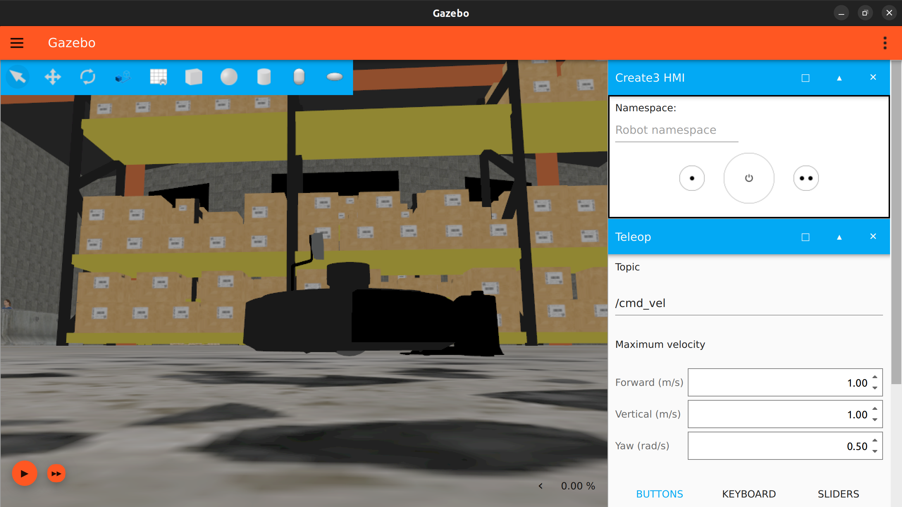

# Turtlebot4 setup

This guide is for the basic setup of the turtlebot4 robot. This is the robot that you will likely use for the robotics project.

The below video describes what hardware you should expect out of the box, and how to turn on the turtlebot4.

<https://drive.google.com/file/d/1kX7NxfBmgbmvqXGU45QzyZxBgYfPsSAU/view?usp=sharing>

## Table of Contents

- [Turtlebot4 setup](#turtlebot4-setup)
  - [Table of Contents](#table-of-contents)
  - [Basic hardware/software setup](#basic-hardwaresoftware-setup)
    - [1. Local PC setup (link to reference)](#1-local-pc-setup-link-to-reference)
    - [2. Robot setup (link to reference)](#2-robot-setup-link-to-reference)
  - [Basic robot control (link to reference)](#basic-robot-control-link-to-reference)
  - [Simulator (link to reference)](#simulator-link-to-reference)
    - [Installation (link to reference)](#installation-link-to-reference)
    - [Running the simulator](#running-the-simulator)
  - [Troubleshooting issues](#troubleshooting-issues)
    - [Turtlebot4 documentation](#turtlebot4-documentation)
    - [Raspberry Pi image setup (link to reference)](#raspberry-pi-image-setup-link-to-reference)

## Basic hardware/software setup

Once you've made sure that you have all the hardware that is expected, you next need to set up both the robot and a local PC you have access to so that you can control the robot using your computer.

To set up the turtlebot4, we use the [setup guide provided in it's documentation](https://turtlebot.github.io/turtlebot4-user-manual/setup/). When you set up a new robot on your own, you typically read though it's documentation and follow along with how the robot's designers recommend you install packages, connect to the robot etc. However, these guides are usually very general purpose and can need some adaptation to make work for your specific setup. To simplify the setup of our specific case, we've put together a guide highlighting some of the important steps that could trip you up.

### 1. Local PC setup ([link to reference](https://turtlebot.github.io/turtlebot4-user-manual/setup/basic.html#user-pc))

To interface with the turtlebot4, we need a PC running ROS Humble. ROS is short for [Robot Operating System](https://www.ros.org/), and is a set of software libraries and tools that simplifies many of the key aspects of building robot applications, such as multiprocessing, message passing, package management and more. Many packages and drivers for existing robots (such as the turtlebot4) rely on ROS, and so can be easily used as a part of a larger ROS application. Each version of ROS corresponds to a major release of Ubuntu, and can only be used with that version. For our purposes, the turtlebot4's existing software kit was developed for [ROS Humble](https://docs.ros.org/en/humble/index.html), which runs on Ubuntu 22.04.

If you do not currently have access to a device with Ubuntu 22.04, you have 2 options:

1. (Recommended) Dual boot your current OS with Ubuntu 22.04. This is preferable as it will lead to better usage of your PC's resources and hence smoother simulation. The process of doing this is somewhat OS specific but if you're not confident and want help setting this us please let us know and we will try to help.
2. (Less intrusive) Set up a virtual machine running Ubuntu 22.04. For this the common choices are either VirtualBox or VMWare. A tutorial going though the installation process can be [found here](https://ubuntu.com/tutorials/how-to-run-ubuntu-desktop-on-a-virtual-machine-using-virtualbox#1-overview) but feel free to use other alternatives if they work better or are easier for you.

To work with the turtlebot4, our Ubuntu 22.04 instance will need both ROS Humble and the turtlebot4 package installed:

- Install ROS Humble in Ubuntu 22.04 by following the installation instructions at <https://docs.ros.org/en/humble/Installation/Ubuntu-Install-Debians.html>. I recommend you install `ros-humble-desktop`, as it is the most complete version of ROS which includes all the visualization tools you can use later for debugging and development.
- Install the turtlebot4 packages with:

    ```bash
    sudo apt update
    sudo apt install \
      ros-humble-turtlebot4-desktop \
      ros-humble-turtlebot4-description \
      ros-humble-turtlebot4-msgs \
      ros-humble-turtlebot4-navigation \
      ros-humble-turtlebot4-node \
      ros-dev-tools \
      ros-humble-depthai-ros
    ```

**NOTE:** ROS requires you to `source` it in every new shell you open to properly use it. If this isn't done, you may run into many other issues that this is the cause of. To avoid these problems, please read through [this guide](https://docs.ros.org/en/humble/Tutorials/Beginner-CLI-Tools/Configuring-ROS2-Environment.html) to understand how to properly set up your ROS environment and automatically source ROS on shell startup.

### 2. Robot setup ([link to reference](https://turtlebot.github.io/turtlebot4-user-manual/setup/basic.html#robot))

When everything has been properly set up, you should be able to control your turtlebot4 wirelessly from your PC. TO be able to do this, you first have to set up a connection to your turtlebot4.

- Turn on the turtlebot4. This can be done by placing it on the dock. When it boots up the led ring should spin white, before turning red and then finally making a sound. The ring should then turn yellow briefly and then solid white, indicating that the robot is on.
  - To turn the robot off, hold the power button until the turn on sound plays and the LED ring turns off.
- Once the robot is on, it will broadcast a hotspot that can be connected to over wi-fi. To connect to the robot, connect to the `Turtlebot4` wifi network (Password: `Turtlebot4`).
- You can now access the robot's raspberry pi by connecting to it via [ssh](https://ubuntu.com/server/docs/service-openssh). To do this, run `ssh ubuntu@10.42.0.1` (password: `turtlebot4`).
- The first thing to do is configure the robot's Wi-Fi connection to connect it to an existing Wi-Fi network. Note that if you want to change the network your robot will connect to, you'll have to change the Wi-Fi settings from this menu again.
  - In the ssh session, run `turtlebot4-setup` to enter the turtlebot4 setup tool.
  - Select "Wi-Fi Setup", and set the network SSID and password to that of the external network you want to connect to.
  - Change the "Wi-Fi Mode" to "Client".
  - Select "Save", and then on the next screen select "Apply Settings".
- The robot should now reboot and apply the new Wi-Fi settings. Note that this might take up to a minute.
- Now, make sure you PC is connected to the same network as your robot. You can find the IP address of the robot on this network by running:

    ```bash
    source /opt/ros/humble/setup.bash
    export RMW_IMPLEMENTATION=rmw_fastrtps_cpp
    export ROS_DOMAIN_ID=0
    ros2 topic echo /ip
    ```

    If this topic is not published, you can also either follow the [instructions here](https://turtlebot.github.io/turtlebot4-user-manual/setup/basic.html#recovering-the-raspberry-pi) and connect directly over ethernet temporarily, or try and find the turtle's IP address by using `ifconfig` to find your Wi-Fi's IP address and find the devices connected to that network with `nmap -sP <network_ip>/<subnet_mask>` (eg. If your IP on the network is `192.168.0.100` with a mask of `255.255.255.0`, you would check `nmap -sP 192.168.0.0/24`).
- You should now be able to ssh back into the turtlebot using the new ip address you found:

    ```bash
    ssh ubuntu@<new_ip_address>
    ```

- As a final step, you should make sure both the raspberry pi and create 3 are up to date.
  - To update the create 3 firmware, follow the [instructions here](https://turtlebot.github.io/turtlebot4-user-manual/setup/basic.html#create-3).
  - To update the raspberry pi packages, run `sudo apt update && sudo apt upgrade` in the ssh session.
    - If you are asked whether to modify the `/etc/turtlebot4/system` config file, make sure to keep the currently installed version.

Once the robot setup is complete, when you run `ros2 topic list` to show all ros topics either on the external PC or in the robot's raspberry pi ssh shell, the list of topics on both devices should be the same (Figure 1).

<div align="middle">
    
    
    <figure>
      <figcaption>Figure 1: Left = local PC ROS topics. Right = remote robot ROS topics.</figcaption>
    <figure>
</div>

## Basic robot control ([link to reference](https://turtlebot.github.io/turtlebot4-user-manual/tutorials/driving.html))

In this section, we'll test that the robot can move. The below video shows what you should expect from the robot, while the written section here provides the actual steps and commands you should use to get your robot moving.

<https://drive.google.com/file/d/17q1sDLznZIDXKMntDbRe6Et0cF-M2I7g/view?usp=sharing>

To check that the robot is working and can be moved, we'll first drive it manually using a keyboard. This can be done using the `teleop_twist_keyboard` package which can be installed by running:

```bash
sudo apt update
sudo apt install ros-humble-teleop-twist-keyboard
```

First, you'll want to undock the turtlebot4. You can do this programmatically by calling an undock ROS action in the command line:

```bash
ros2 action send_goal /undock irobot_create_msgs/action/Undock "{}"
```

Note that this may take some time when first ran. Once the robot is undocked, you should see that is has spun around. This is because the front of the robot is the side with the power button (and hence also the 'forward' direction). You should now be able to run the teleoperation node:

```bash
ros2 run teleop_twist_keyboard teleop_twist_keyboard
```

The grid on the screen should show the controls, where `i` is forward, `j` is left, `l` is right and so on. Be aware that the robot doesn't like driving backward and will freeze if you make it after a short distance. The proper way to make the robot drive backwards is to rotate the robot so it faces the desired direction first, before driving forwards.

Once you are done testing, you can dock the robot programmatically similar to how you undocked it:

```bash
ros2 action send_goal /dock irobot_create_msgs/action/Dock "{}"
```

And then if you want to similarly turn off the robot, you can run:

```bash
ros2 service call /robot_power irobot_create_msgs/srv/RobotPower "{}"
```

## Simulator ([link to reference](https://turtlebot.github.io/turtlebot4-user-manual/software/simulation.html))

If you want to test code running on the turtlebot4 without access to the physical robot, you can use a simulation of the robot instead. The turtlebot4 package comes with built-in support for [ignition gazebo](https://gazebosim.org/api/gazebo/2.10/index.html) (the [gazebo](https://gazebosim.org/) simulator), so we'll use this as our simulator.

- **Note 1:** This should of course all be installed on your local PC, not the robot.
- **Note 2:** To run gazebo, it is recommended to have a dedicated GPU for your PC, otherwise the simulator may be prohibitively slow.

### Installation ([link to reference](https://turtlebot.github.io/turtlebot4-user-manual/software/turtlebot4_simulator.html))

First we need to install `ignition-fortress`:

```bash
sudo apt-get update && sudo apt-get install wget
sudo sh -c 'echo "deb http://packages.osrfoundation.org/gazebo/ubuntu-stable `lsb_release -cs` main" > /etc/apt/sources.list.d/gazebo-stable.list'
wget http://packages.osrfoundation.org/gazebo.key -O - | sudo apt-key add -
sudo apt-get update && sudo apt-get install ignition-fortress
```

Then we can install the simulator:

```bash
sudo apt update
sudo apt install ros-humble-turtlebot4-simulator
```

### Running the simulator

To start the simulator in a generic world with the turtlebot4 lite, you can run:

```bash
ros2 launch turtlebot4_ignition_bringup turtlebot4_ignition.launch.py model:=lite
```

On the first startup, this might take a while to boot, as it has to download assets and set everything up, so just leave it until it fully boots unless there is some major error.

Once the simulator launches, you should see the robot in a warehouse (Figure 2):

<div align="middle">
    
</div>

<div align="middle">
  <figure align="middle">
    <figcaption>Figure 2: Ignition gazebo when launched</figcaption>
  <figure>
</div>

From here you can control the simulated robot exactly the same as you would the real robot, by sending action commands, publishing to topics, calling services etc. See some of the ways you can do this [here](https://turtlebot.github.io/turtlebot4-user-manual/tutorials/driving.html).

Here is an example of some basic commands you might send to the robot to perform basic actions:

- Undock the robot before moving: `ros2 action send_goal /undock irobot_create_msgs/action/Undock "{}"`
- Rotate the robot 90°: `ros2 action send_goal /rotate_angle irobot_create_msgs/action/RotateAngle "{angle: 1.57}"`
- Move forward 1 meter: `ros2 action send_goal /drive_distance irobot_create_msgs/action/DriveDistance "{distance: 1}"`

**Note:** Before you start controlling the robot by sending ROS commands, make sure to start the simulation by pressing the play (▶︎) symbol in the bottom left corner.

## Troubleshooting issues

When we set up our turtlebot for the first time it wasn't super smooth. Mistakes were made, we had to re-flash the raspberry pi a few times and work through many small errors. This is just all in the process of learning to set up a robot though, so don't be discouraged if this happens to you.

If issues *do* arise during setup or usage, they may be covered here. If they're not you'll have to search around the internet for a solution, or if that also doesn't work ask the TA's for help (as a last resort).

### Turtlebot4 documentation

The first port of call when you have an issue with a robot should always be it's documentation. For the turtlebot4, the documentation can be found at <https://turtlebot.github.io/turtlebot4-user-manual/>, as we've been referring to through the setup guide.

A useful section to check that you may miss is the [troubleshooting section](https://turtlebot.github.io/turtlebot4-user-manual/troubleshooting/), which covers some basic issues that commonly occur.

You can also find the specs of the [turtlebot4 lite here](https://www.generationrobots.com/media/turtlebot4/Turtlebot_4_OverviewBrochure.pdf), which can help you figure out some of the limits of the robot.

### Raspberry Pi image setup ([link to reference](https://turtlebot.github.io/turtlebot4-user-manual/setup/basic.html#install-latest-raspberry-pi-image))

If you run into major issues with the turtlebot4's raspberry pi, you can re-flash the robot's image to start over. Note that this will of course reset everything on the robot, and so is best done either early on if some unresolvable issues with Wi-Fi occur, or as a last resort.

- Remove the micro SD card from the turtlebot4, ensuring the robot is powered off and that you carefully unplug the 3 cables connected to the raspberry pi as you remove it.
- Connect the micro SD card to your PC.
- Download the latest turtlebot4 lite ros humble image from <http://download.ros.org/downloads/turtlebot4/>. The image should be named something similar to `turtlebot4_lite_humble_x.x.x.zip`, where `x.x.x` is the version of the image. Make sure to extract the `.img` file from the zip archive.
- Follow the [reference instructions](https://turtlebot.github.io/turtlebot4-user-manual/setup/basic.html#install-latest-raspberry-pi-image) beginning from the installation of `dcfldd` to flash the extracted `.img` to the micro SD card.
- Reinsert the micro SD card into the raspberry pi, reconnect all the cables to the raspberry pi and reinsert the raspberry pi compartment into the turtlebot4.
